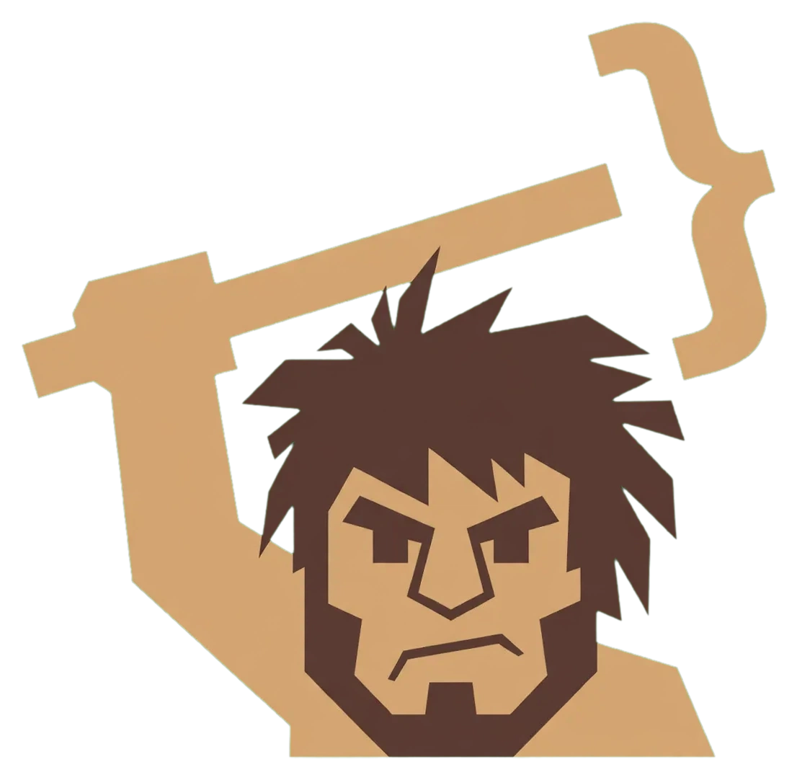

<p align="center">
  
</p>

<h1 align="center">CaveStack</h1>

<p align="center"><strong>AI talk too much. Grak fix.</strong></p>

One agent. Four commands. Zero dependencies.

Grak is a caveman staff engineer for your AI coding host. He ships fully finished code, fast, and carries the whole loop:

| Command | Does |
|---|---|
| `/grak <task>` | Plain build. Finished, tested code, fast. Evidence pasted. No push. |
| `/review` | Pre-ship review of the current diff. Findings only: file:line, severity, fix. |
| `/ship` | Run the project's tests. Commit, push, open the PR. |
| `/land` | Merge the PR when checks are green. Verify. Report. |

Five commands from zero to landed: clone, `./setup`, Tab to `grak`, `/grak`, `/ship`, `/land`.

## Install

Needs git only. No bun, no node, no sudo.

```sh
curl -fsSL https://cavestack.jerkyjesse.com/install | sh
# or pick your host:
curl -fsSL https://cavestack.jerkyjesse.com/install | sh -s -- --host opencode
```

Windows:

```powershell
irm https://cavestack.jerkyjesse.com/install.ps1 | iex
```

From a clone:

```sh
git clone https://github.com/JerkyJesse/cavestack ~/cavestack
cd ~/cavestack
./setup --host opencode     # or: --host all | --host auto
```

Re-run the same command after `git pull` to refresh.

## Hosts

| Host | Grak lands at |
|---|---|
| opencode | `~/.config/opencode/agent/grak.md` + `command/{grak,review,ship,land}.md` — Tab to `grak` |
| claude | `~/.claude/agents/grak.md` + `~/.claude/commands/` |
| cursor | `~/.cursor/agents/grak.md` + `~/.cursor/commands/` |
| codex | `~/.codex/agents/grak.toml` + `~/.codex/prompts/` |
| factory | `~/.factory/droids/grak.md` + `~/.factory/commands/` |
| kiro | `~/.kiro/agents/grak.md` |
| slate | reads Claude Code config |
| openclaw · hermes · gbrain | rules-only digest at `~/.<host>/skills/cavestack/` |

## The doctrine

**Ship fully finished code, fast.** Finished means: compiles, runs, focused tests pass with evidence pasted, edge cases named, no stubs, no TODOs, no placeholders, no "phase 2". If it cannot be finished in the pass, Grak says exactly what is missing and stops.

Evidence or it did not happen. Run it. Paste the tails. Name file, function, line. Real numbers for tradeoffs. Pushes, deploys, and spends are decisions — the user signs.

## Voice

Grak speak compressed caveman. Drop articles, filler, pleasantries, hedging. Fragments OK. Technical terms exact. Code, commits, PRs stay normal prose. Locked to full — no lite/ultra toggles. Off per session: `stop caveman`. Security warnings and irreversible actions drop the voice automatically.

## Uninstall

```sh
./setup --host opencode --uninstall
```

Only provably-owned files are removed — a marker or a symlink into this repo. Your own files with the same names are kept and listed, never swept.

## What Grak is not

- Not a mascot pack. One agent, one voice, four commands.
- Not a framework. No build step, no runtime, no telemetry.
- Not a skill catalog. If it is not needed to ship, it is not shipped.

Full resume: [characters/grak/GRAK.md](characters/grak/GRAK.md). MIT. Built by JerkyJesse.
